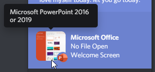

# DiscordForOffice
Show the world how much you love presenting, spreadsheets and writing with the full DiscordForOffice suite of products

- [Downloads](https://github.com/Terminal/DiscordForOffice/releases)
    - Please follow the instructions
- [Technical Support](https://discord.gg/wHgdmf4)

## Compatability

### Versions
- Microsoft Office 2013
- Microsoft Office 2016
- Microsoft Office 2019
- Microsoft Office 365

### Products
- Word
- PowerPoint
- Excel
- Outlook
    - This has no functionality yet.
    - Give ideas at ([#20](https://github.com/7coil/DiscordForOffice/issues/20))

### Not Compatible
- Access (see [#16](https://github.com/7coil/DiscordForOffice/issues/16))
- Publisher (see [#5](https://github.com/7coil/DiscordForOffice/issues/5))
- OneNote (see [#9](https://github.com/7coil/DiscordForOffice/issues/9))
- Teams (see [#19](https://github.com/7coil/DiscordForOffice/issues/19))
- All other Microsoft products

## Examples

## Compiling
1. Enable `Office/SharePoint development` in the Visual Studio Installer
2. Right click the solution and select the build option
3. The installer, which is ready to distribute, can be found here:
    - `/Bundler/bin/Debug/DiscordForOffice.exe`
    - `/Bundler/bin/Release/DiscordForOffice.exe`
